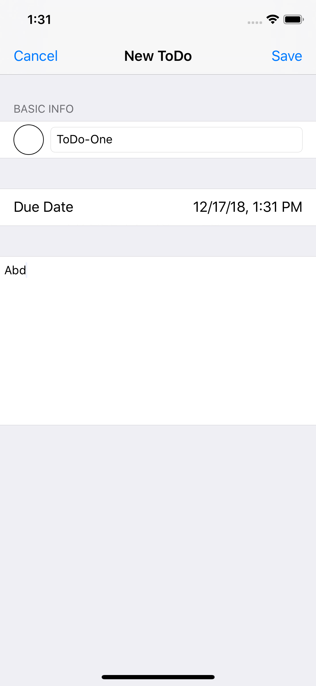

# To-Do List
## Initial Features
### -Home screen with overview of ToDos
### -Create new ToDo
### -Edit a ToDo
### -Delete a ToDo
### -Check a ToDo

## Updated Features
### -Added a search bar
### -Added a function to edit the searched ToDo and update the data of the homescreen
### -Added the function to delete the searched ToDo and update the data of the homescreen
### -Added the function to check the searched ToDo and update the data of the homescreen

### Home Screen
<kbd></kbd>

### Delete Function
<kbd></kbd>

### New ToDo
<kbd></kbd>

### Searched ToDo
<kbd></kbd>
